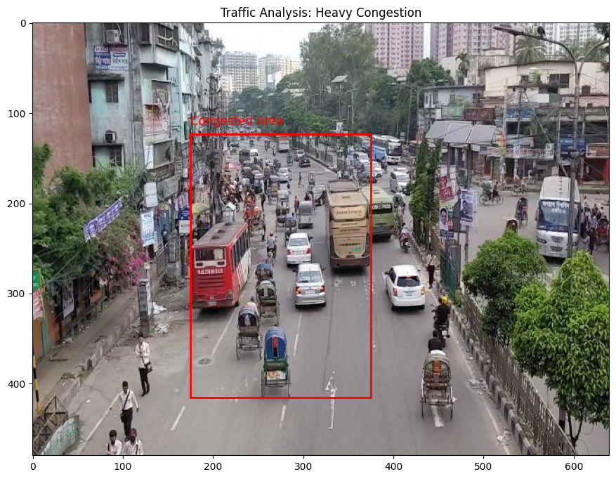

# Congested Traffic Region Detection

This repository contains the code and resources for detecting traffic congestion regions in various parts of Dhaka city. Using the Faster R-CNN model for object detection and DBSCAN for clustering, this project identifies congested areas by analyzing traffic flow data.

## Dataset

We used the [Bangladeshi Traffic Flow Dataset](https://data.mendeley.com/datasets/h8bfgtdp2r/3), which is annotated into 9 classes including various vehicles and people. The dataset was converted into COCO format for compatibility with our models.

## Project Structure

- `dhaka-vehicle-detection-faster-r-cnn.ipynb`: Notebook for training the Faster R-CNN model to detect vehicles and people.
- `congested-region-detection-using-dbscan.ipynb`: Notebook for detecting congested regions using DBSCAN based on the output from the Faster R-CNN model.

## Methodology

### Faster R-CNN Training

1. **Data Preparation**: Convert the Bangladeshi Traffic Flow Dataset into COCO format.
2. **Model Initialization**: Initialize a Faster R-CNN model with pre-trained weights.
3. **Training**: Train the model with the dataset over multiple epochs. The training process includes calculating the average loss per epoch to monitor performance.
4. **Output**: The model with the lowest average loss (from the 17th epoch) is selected for further congestion detection.

Training Parameters:
- **Backbone**: ResNet-50
- **Optimizer**: ADAM
- **Learning Rate**: 0.0001
- **Batch Size**: 4
- **Epochs**: 20
- **Scheduler**: StepLR (step size=3, gamma=0.1)

Training Results:

| Epoch | Average Loss |
|-------|---------------|
| 0     | 0.5877        |
| 1     | 0.5449        |
| 2     | 0.5064        |
| 3     | 0.4061        |
| 4     | 0.3734        |
| 5     | 0.3500        |
| 6     | 0.3247        |
| 7     | 0.3210        |
| 8     | 0.3180        |
| 9     | 0.3152        |
| 10    | 0.3146        |
| 11    | 0.3145        |
| 12    | 0.3138        |
| 13    | 0.3137        |
| 14    | 0.3137        |
| 15    | 0.3137        |
| 16    | 0.3136        |
| 17    | 0.3135        |
| 18    | 0.3138        |
| 19    | 0.3140        |

### Congested Region Detection using DBSCAN

1. **Image Analysis**: Use the trained Faster R-CNN model to detect vehicles and people in images.
2. **Information Extraction**: Extract relevant information such as the count of vehicles and people, and potential congested regions.
3. **DBSCAN Clustering**: Apply DBSCAN clustering to identify congested regions based on the density of detected objects.
4. **Visualization**: Visualize the images with marked congested regions.

DBSCAN Parameters:
- **eps**: 75 (the maximum distance between two samples for one to be considered as in the neighborhood of the other)
- **min_samples**: 5 (the number of samples in a neighborhood for a point to be considered as a core point)

Example Output:
```json
{
    "vehicle_count": 23,
    "people_count": 4,
    "congested_regions": [[175.94656, 123.34937, 375.40375, 415.21686]],
    "congestion_count": 1,
    "people_in_congested_areas": 0
}
```




## Usage

1. **Clone the Repository**: 
    ```bash
    git clone https://github.com/Samia35-2973/Congested_Traffic_Region_Detection.git
    ```
2. Download the dataset from the link mentioned earlier and convert it to COCO format. If you want the converted dataset you can contact me.
3. The implementation was done in Kaggle with GPU t4 x2 acceralator.

## Conclusion

This project provides a comprehensive approach to detecting traffic congestion in Dhaka city using state-of-the-art object detection and clustering techniques. The results can help in monitoring and managing traffic more effectively. It is still in it's improvement phase for more accurate detection with better approach.
